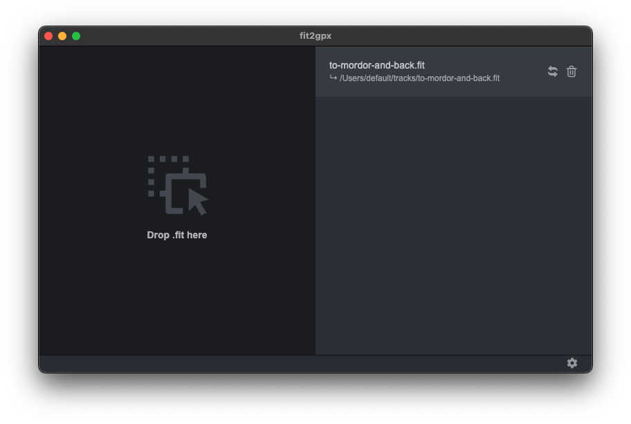

# fit2gpx - Multiplatform FIT to GPX convert

[](https://github.com/fayriot/fit2gpx/releases/latest)



This is a simple Electron App for converting .FIT files to .GPX files.

## Download/Install

Linux:

- [AppImage / .deb / portable version](https://github.com/fayriot/fit2gpx/releases/latest)

Windows:

- [Installable / portable version](https://github.com/fayriot/fit2gpx/releases/latest)

MacOS:

- [ZIP which contains the app bundle / .dmg](https://github.com/fayriot/fit2gpx/releases/latest)


# Build

Feel free to build for any target platform with [electron-builder](https://www.electron.build/):

```bash
yarn electron-builder --mac --arm64 --linux --x64 --win --x64
```

# Dependencies
### sports-lib
[sports-lib](https://github.com/sports-alliance/sports-lib/) is a Library for processing GPX, TCX, FIT and JSON files from services such as Strava, Movescount, Garmin, Polar etc.
